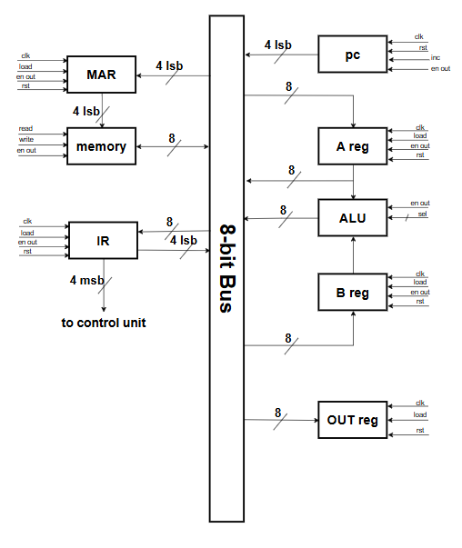
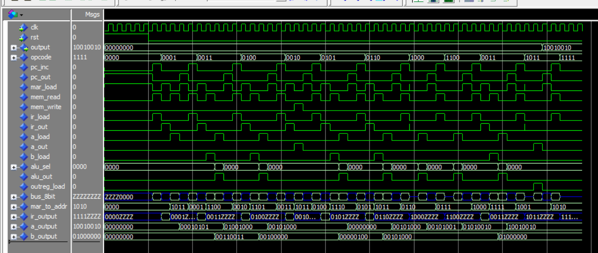
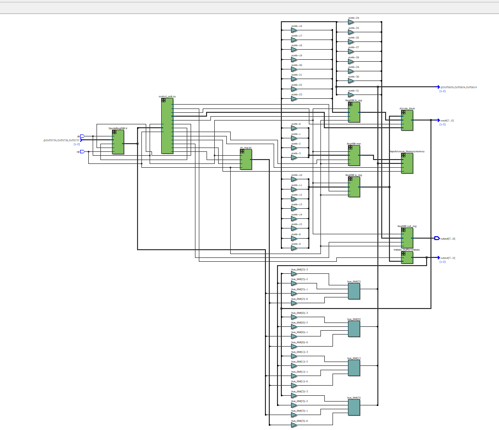
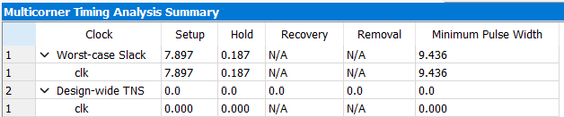

## Overview
This report documents the design, development, and simulation of an 8-bit microprocessor. The architecture follows a classical fetch-decode-execute cycle and includes components for data storage, arithmetic logic operations, instruction handling, and control. The design was implemented in VHDL and verified using behavioral testbenches. The microprocessor's datapath and control logic are aligned with the architectural block diagram provided in the "8-bit microprocessor".

## Block Diagram

## System Components
The microprocessor is composed of the following key modules:

### 1. Registers 
* **Reg8Bit / Reg4Bit**: These synchronous registers are used to store 8-bit or 4-bit data respectively. Each register supports clocked input with asynchronous reset and load control. In the datapath, Reg8Bit modules are used for the accumulator (A register), B register, and the output register. Reg4Bit is used as the Memory Address Register (MAR), holding 4-bit memory addresses derived from the instruction register.
* **SpecialReg8Bit**: This is used as the Instruction Register (IR). It constantly outputs the upper 4 bits (opcode) and conditionally outputs the lower 4 bits (address/immediate) depending on the control signal `en_out`. This separation is critical for proper decoding and addressing.
* **pc_reg**: The Program Counter (PC) is a 4-bit register with increment capability. It features a tri-state output enabling it to place its value onto the shared data bus only when `en_out` is high.

### 2. Memory 
* **Asynchronous_Memory**: This 16 x 8-bit memory module supports asynchronous read and write. It acts as both instruction memory and data memory. The memory contents are preloaded to reflect a test program, as defined in its VHDL file. The module uses address input from MAR and data passed through a bidirectional bus (`data_io`). It contains both instruction opcodes and data bytes at the same address range (0–15).

**Memory Initialization Example:**

| Address | Value | Description                  |
|---------|-------|------------------------------|
| 0       | 1B    | LDA 1011 - Load from addr 11  |
| 1       | 3C    | ADD 1100 - Add from addr 12   |
| 2       | 4D    | SUB 1101 - Subtract addr 13   |
| 3       | 2B    | STA 1011 - Store to addr 11   |
| 4       | 5E    | AND 1110 - And with addr 14   |
| 5       | 6B    | OR 1011 - Or with addr 11     |
| 6       | 80    | INC                           |
| 7       | C0    | SHL                           |
| 8       | 3F    | ADD 1111 - Add from addr 15   |
| 9       | B0    | OUT                           |
| 10      | F0    | HLT                           |
| 11–15   | 15–40 | Data values used by instructions  |

### 3. Arithmetic Logic Unit (ALU)
The ALU performs all core computation operations based on a 4-bit selector:

| Operation | Selector | Description            |
|-----------|----------|------------------------|
| ADD       | 0011     | Add B to A             |
| SUB       | 0100     | Subtract B from A      |
| AND       | 0101     | Logical AND A & B      |
| OR        | 0110     | Logical OR A           |
| NOT       | 0111     | Bitwise NOT A          |
| INC       | 1000     | Increment A by 1       |
| DEC       | 1001     | Decrement A by 1       |
| SHL       | 1100     | Shift A left by 1      |
| SHR       | 1101     | Shift A right by 1     |
| NEG       | 1110     | Two's complement of A  |

These operations are executed based on instructions decoded and issued by the control unit.

### 4. Control Unit (FSM) 
The `control_unit` is structured as a finite state machine (FSM) with 6 states:
* **FETCH1**: Load PC output into MAR 
* **FETCH2**: Read instruction from memory into IR; increment PC 
* **DECODE**: Determine instruction type and target state 
* **EXECUTE1**: Memory access or single-cycle execution 
* **EXECUTE2**: ALU execution (for 2-cycle instructions) 
* **HLT**: Halt the processor (using opcode `1111`) 

The control unit drives all internal control signals for data transfer, ALU operations, and memory access.

### 5. Bus Architecture 
The system uses a single 8-bit bus for internal data movement: 
* All register outputs and ALU results are sent through the bus 
* Controlled using tri-state buffers to avoid bus contention
* Components like PC, memory, and registers are only active on the bus when enabled           

### 6. Datapath Mapping from Diagram
According to the datapath diagram in the PDF:
* PC connects to the MAR via the bus (lower 4 bits) 
* MAR indexes the address of Asynchronous_Memory 
* Memory places instruction/data onto the bus when `mem_read` is high 
* IR captures instruction, outputting opcode and address separately 
* A and B registers store operands for computation 
* ALU performs the operation based on `alu_sel` 
* Final result is stored in A or moved to output register via OUT instruction 

This matches the structure and dataflow described in VHDL and validated in simulation.

## Instruction Set Summary 
Each instruction is 8 bits wide: 

| Instruction | Assembly  | Description                 |
|-------------|-----------|-----------------------------|
| 0000 0000   | NOP       | No Operation                |
| 0001 xxxx   | LDA addr  | Load addr to A              |
| 0010 xxxx   | STA addr  | Store A to addr             |
| 0011 xxxx   | ADD addr  | A = A + mem[addr]           |
| 0100 xxxx   | SUB addr  | A = A - mem[addr]           |
| 0101 xxxx   | AND addr  | A = A & mem[addr]           |
| 0110 xxxx   | OR addr   | A = A \| mem[addr]          |
| 0111 0000   | NOT       | A = NOT A                   |
| 1000 0000   | INC       | A = A + 1                   |
| 1001 0000   | DEC       | A = A - 1                   |
| 1010 0000   | CLR       | A = 0                       |
| 1011 0000   | OUT       | Send A to output reg        |
| 1100 0000   | SHL       | A = A << 1                  |
| 1101 0000   | SHR       | A = A >> 1                  |
| 1110 0000   | NEG       | A = -A                      |
| 1111 xxxx   | HLT       | Finish the Program          |

## Simulation Results 
All modules were tested individually:
* `tb_Reg8Bit`, `tb_Reg4Bit`, `tb_ALU`, `tb_SpecialReg8Bit`, `tb_Simple_Async_Memory`, `tb_microprocessor` all passed with expected results.
In full-system simulation (`tb_microprocessor`): 
* Program loaded via memory executed correctly.
* A loaded with memory values, modified through arithmetic and logic.
* Final value moved to `output` via OUT instruction.
* Simulation ran for 2 ms with proper reset and monitored output.

## Design Quality Evaluation (Based on Image Criteria) 

| Quality Criteria        | Evaluation                                  |
|-------------------------|---------------------------------------------|
| Clarity of Architecture | Clear separation of datapath and control    |
| Correctness             | All testbenches passed; FSM well-defined    |
| Code Modularity         | Components are modular and reusable         |
| Instruction Set Coverage| Full coverage including edge instructions   |
| Memory Initialization   | Program + data setup verified in memory     |
| Bus Handling            | Correct tri-state usage and signal control  |
| Simulation Output       | Logging and waveform review successful      |

## Schematic 

## Timing Analysis 

## Conclusion 
The 8-bit microprocessor is a complete, functioning system with support for arithmetic, logic, memory, and control operations. The modular design ensures readability, maintainability, and extensibility. Simulation results confirm correctness. The architectural alignment with the provided block diagram is consistent, making the design both educational and implementation-ready for FPGA development. The inclusion of tabulated instruction and ALU operation summaries, validated VHDL implementations, and thorough simulation confirms the robustness of this processor design. Future enhancements may include flag registers (zero, carry), interrupt handling, or expansion of instruction width for extended functionality.